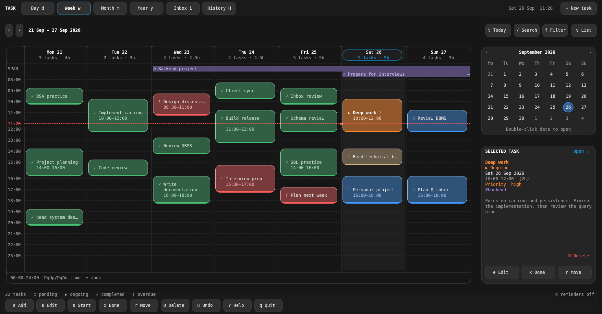
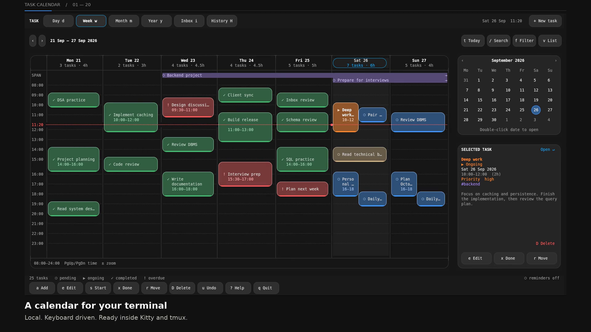
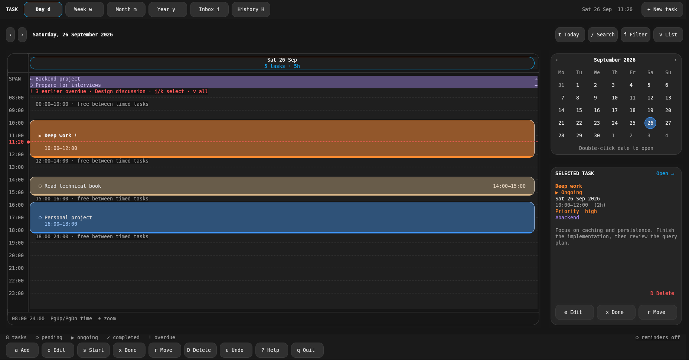
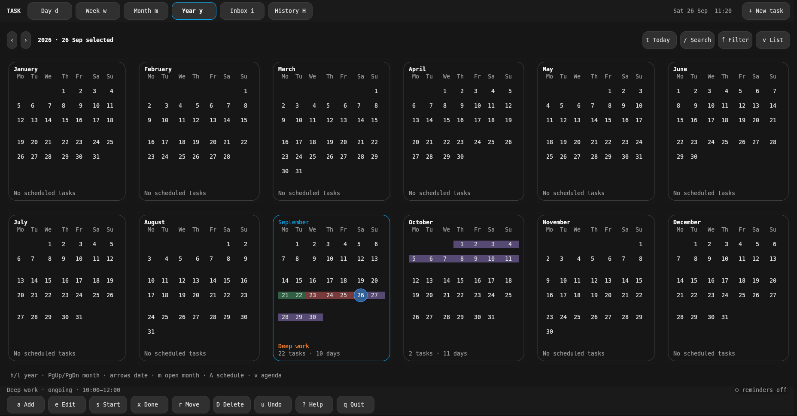

# Task Calendar

**Your schedule, inside your terminal.**

A local task calendar for Linux, built for Kitty, tmux and keyboard navigation.
Plan by day, week, month or year. Use your mouse when it helps. Keep everything
on your own machine—even reminders work without an internet connection.

[Download v1.6.0](https://github.com/jeel00dev/TUI_TASK_MANAGER/releases/download/v1.6.0/task-calendar-1.6.0.tar.gz) · [Watch the feature tour](docs/task-calendar-tour.mp4) · [User guide](docs/guide.md) · [MIT license](LICENSE)

[](docs/task-calendar-tour.mp4)

## A calendar that works with you

- **See your time.** Overlapping tasks, multi-day work, free periods and a live time marker.
- **Capture, then plan.** Inbox, quick scheduling, three priorities, tags and notes.
- **Keep moving.** Recurrence, search, filters, completed history and undo—including deletion.
- **Stay informed.** Local desktop reminders 15 minutes before a task and at its start, even with the TUI closed.

No accounts, cloud services or Python package dependencies.

## Download and install

Requires **Linux and Python 3.10+** with curses and SQLite. Use **Kitty** for smooth
rounded rendering, including inside tmux. Other terminals use text borders.
The minimum terminal size is **90 columns × 28 rows**.

1. [Download the application](https://github.com/jeel00dev/TUI_TASK_MANAGER/releases/download/v1.6.0/task-calendar-1.6.0.tar.gz).
2. Extract and install:

```sh
tar -xzf task-calendar-1.6.0.tar.gz
cd task-calendar-1.6.0
./task install
task
```

Already have the source checkout? Run `./task install` there to install or update.
If `task` is not found, add `~/.local/bin` to your shell's PATH:

```sh
export PATH="$HOME/.local/bin:$PATH"
```

Run `task` in your existing Kitty or tmux window. For mouse input in tmux,
add `set -g mouse on` to `~/.tmux.conf`. For a TUI-only installation, use
`./task install --no-autostart`.

### Desktop reminders

Install `notify-send` and use your desktop notification daemon. On Void Linux:

```sh
sudo xbps-install -S libnotify
task reminders --test
```

Already running Dunst or another notification daemon? Nothing else is needed.
If you need Dunst, install it with `sudo xbps-install -S dunst`, then run
`task install --with-dunst`.

Installation enables reminders at desktop login through XDG autostart or i3.
For a session that does not load either, add `exec --no-startup-id ~/.local/bin/task reminders`
to your i3 config. No systemd is required. `task doctor` checks the setup.

## Start using it

Press **a**, type a title, then **Enter** to capture a task in Inbox. Press **A**
to create a scheduled task on the selected date. In the editor, **Tab** moves
between fields and **Ctrl-S** saves.

| Key | Action |
| --- | --- |
| `d` `w` `m` `y` | Day, week, month, year |
| `t` / `g` | Today / go to a date |
| `h` `l` / `j` `k` | Previous or next range / select tasks |
| `a` / `A` / `e` | Capture / schedule / edit |
| `s` / `x` / `p` | Start / complete / return to pending |
| `r` | Move a task while preserving its duration |
| `D` / `u` | Delete / undo |
| `/` / `f` | Search / filter |
| `i` / `H` | Inbox / completed history |
| `Enter` | Full details and notes |
| `+` `-` / `v` | Zoom the time grid / toggle agenda |
| `z` | Snooze once |
| `?` / `q` | Searchable commands / quit |

Click tabs, dates, tasks and action buttons; double-click a task for details.
Deletion is also available in the footer and task details. Press **u** to restore it.

**Scheduling:** use `2026-10-04 17:00`, `tomorrow 09:00`, or just `17:00`.
Date-only ranges include the end date. Blank dates keep a task in Inbox.
Recurrence accepts `daily`, `weekly`, `monthly`, `weekdays` or `mon,wed,fri`.
Completing one occurrence keeps future occurrences intact.

**Search:** try `postgres`, `#backend`, or `state:overdue priority:high`.
Reschedule with `tomorrow`, `+1h`, `+1d`, `+1w`, or another date.
Notifications never change task state; only your actions do.

### Quick capture from the shell

```sh
task add "Learn Redis persistence"
task add "DSA practice" --start "today 17:00" --end "19:00" --repeat daily
task list --view week
```

## See it in action

[](docs/task-calendar-tour.mp4)

[Watch or download the feature tour](docs/task-calendar-tour.mp4) · **2:24 · 1080p · sound**
Recorded from the application with sample tasks, zooms, chapter captions and an
original soundtrack. Audio is optional; every feature is explained on screen.

| Day · time and free periods | Year · the longer view |
| --- | --- |
|  |  |

[Month view](docs/month.png) · [Task editor](docs/editor.png) · [Complete user guide](docs/guide.md)

## License

Free to use, modify and share, including commercially, under the [MIT license](LICENSE).
